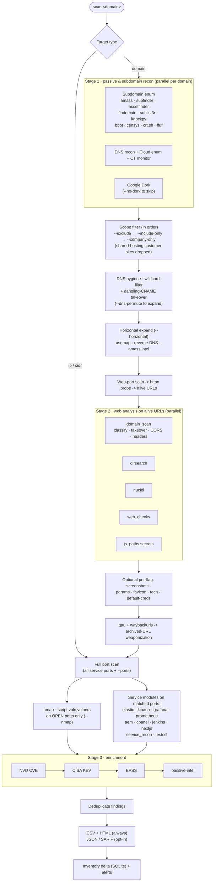
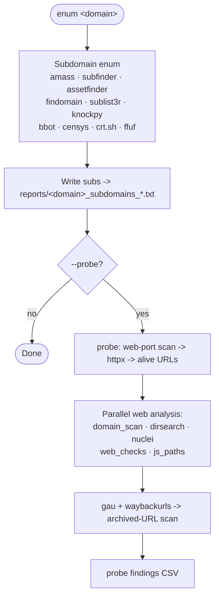
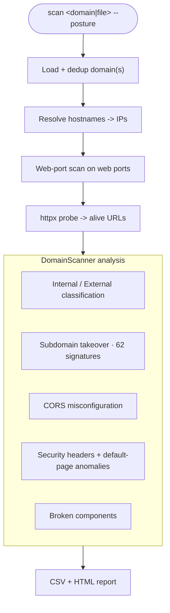

# VaktScan - Attack Surface Scanner

> *"vakt"* is the Nordic word for *"guard"* or *"watch"*.

VaktScan is an async, high-throughput attack-surface / ASM scanner. Point it at a domain, IP, CIDR, or a mixed targets file and it runs the full pipeline - subdomain enumeration, passive recon (DNS, cloud, certificate-transparency, Google dorking), HTTP probing, service/CVE checks, JavaScript secret hunting, archived-URL weaponization, TLS posture, and multi-source vulnerability enrichment - concurrently, then writes de-duplicated findings and maintains a SQLite asset inventory with delta alerting.

Every external tool it drives is **optional**: if a binary is missing, that stage is skipped gracefully and the rest of the scan continues.


## Key Features

- **Unified subcommand CLI** - `scan` (with `--posture`), `enum`, `probe`, `dns`, `cloud`, `js-paths`, `google-dork`.
- **Full auto pipeline** - `scan <domain>` runs enumeration → passive recon → probing → service checks → enrichment → reporting with no extra flags.
- **Subdomain enumeration** - amass, subfinder, assetfinder, findomain, sublist3r, knockpy, bbot, censys, crt.sh, plus ffuf VHost fuzzing.
- **Passive recon in parallel** - DNS recon, cloud-asset enumeration, and certificate-transparency monitoring run concurrently per domain, alongside Google dorking.
- **DNS hygiene (on by default)** - wildcard-filters enumerated hosts (puredns/massdns) to drop catch-all false positives; optional permutation expansion (alterx/dnsgen).
- **Scope control** - `--exclude` / `--include-only` (glob or `re:` regex, inline or from a file) plus `--company-only`, which resolves every subdomain, maps IPs, and scans **only the company's own assets** - dropping customer sites that crowd a shared hosting IP (validated on a real 22,413-subdomain website-builder domain: **99% reduction**, 22,259 customer sites excluded, ~154 company assets kept).
- **DNS-level subdomain takeover (on by default)** - flags dangling CNAMEs (`CNAME → NXDOMAIN`, double-checked A+AAAA) across all discovered subdomains, catching takeovers that serve no HTTP response and so are invisible to the HTTP-based signatures.
- **Web analysis** - httpx alive-probing then dirsearch, nuclei, `web_checks` (security headers, exposed `.git`/`.env`, CORS, cookie flags, WAF detection, GraphQL/Swagger exposure, EOL software), and a domain scanner (internal/external classification, 62 subdomain-takeover signatures, CORS, header anomalies).
- **Archived-URL weaponization** - gau + waybackurls harvest, dedup, high-signal filter, live re-probe, and archived-JS secret scan.
- **JavaScript analysis** - hardcoded secrets, source maps, internal IPs, endpoint extraction and probing.
- **Port scanning + service modules** - async TCP scan, then per-service CVE modules (Elasticsearch, Kibana, Grafana, Prometheus, Next.js, AEM, cPanel/WHM, Jenkins, plus a broad `service_recon` covering 80+ ports) and `testssl.sh` TLS posture.
- **Nmap CVE scripts** - `nmap --script vuln,vulners` runs **only on the open ports the port scanner already found** (no separate full 1-65535 sweep), gated behind `--nmap`.
- **Enrichment** - NVD CVE lookup, CISA KEV cross-reference, EPSS exploit-probability scoring, and Shodan/Censys passive intel.
- **Reporting & state** - CSV + HTML reports are **always** written to `reports/`; JSON and SARIF 2.1 are opt-in. A SQLite inventory tracks assets and emits "new vs resolved" deltas, and `notify.py` sends Slack/Discord/webhook/email alerts on new findings (env-gated).
- **Opt-in expansions** - screenshots, parameter discovery, favicon (mmh3) + JARM pivots, tech fingerprint + EOL, confirmed default-credential checks, and horizontal/infra expansion (asnmap, reverse-DNS, amass intel).
- **Scale features** - streaming mode for large CIDRs, **resumable scans** (auto-resume for any target type - domain/IP/CIDR/file - with graceful Ctrl+C shutdown that checkpoints progress to `.vaktscan/state/` and cleanly terminates every running tool), IPv6, proxy support, and a live multi-row progress dashboard.


## Requirements & Installation

- **Python 3.8+** (tested 3.8-3.11).
- Python packages: `httpx`, `requests`, `urllib3`, `beautifulsoup4`, `playwright` (+ stealth) - see `requirements.txt`.
- **Optional external tools** - subdomain enum (amass, subfinder, assetfinder, findomain, sublist3r, knockpy, bbot, censys), probing (httpx, ffuf, dirsearch, nuclei), scanning (nmap, testssl.sh), archives (gau, waybackurls, uro), DNS hygiene (puredns, massdns, alterx, dnsgen, dnsx), expansion (asnmap, amass), and optional add-ons (gowitness/aquatone, arjun/paramspider/gf, webanalyze). **All are optional** - any missing tool simply skips its stage.

```bash
git clone https://github.com/Bhanunamikaze/VaktScan.git
cd VaktScan

# Python dependencies
pip install -r requirements.txt

# Optional: install the external recon/scanning tools
bash requirements.sh
```

Check or selectively install external tools:

```bash
python scripts/setup_recon_tools.py            # view install status
python scripts/setup_recon_tools.py --install  # install all missing tools
python scripts/setup_recon_tools.py --install --tools amass httpx nuclei
```


## Quick Start

```bash
# Full scan of a single domain (subdomain enum + all modules)
python main.py scan steinzsecurity.com

# Scan an IP or CIDR (skips subdomain enum / passive recon, goes straight to port scan)
python main.py scan 192.168.1.0/24

# Scan a mixed targets file (domains, IPs, CIDRs)
python main.py scan targets.txt

# Skip subdomain enumeration for a domain target
python main.py scan steinzsecurity.com --no-subdomain-enum

# Resume: re-running the same command auto-resumes where it left off
# (works for domain / IP / CIDR / file targets, not just files)
python main.py scan targets.txt
python main.py scan targets.txt --fresh   # ignore prior state, start over
python main.py scan --list-resumable      # list resumable scans, then exit

# High concurrency with Nmap CVE scripts and JSON + SARIF output
python main.py scan targets.txt -c 500 --nmap --format all

# Subdomain enum only, then chain into probing
python main.py enum steinzsecurity.com --probe
```

### Scope control & advanced examples

```bash
# Company assets only - drop customer sites on shared hosting (raise the shared-IP
# cutoff to 15), run Nmap CVE scripts on open ports, and skip any *blog* hosts
python main.py scan steinzsecurity.com --nmap --company-only --shared-ip-threshold 15 --exclude "*blog*.steinzsecurity.com"

# Exclude multiple customer/partner patterns (repeatable), glob or regex
python main.py scan steinzsecurity.com --exclude "customer*.steinzsecurity.com" --exclude "re:^partner-"

# Exclude patterns from a file (one per line, # comments allowed)
python main.py scan steinzsecurity.com --exclude-file skip_customers.txt

# Allowlist: scan ONLY the hosts you care about
python main.py scan steinzsecurity.com --include-only "*.corp.steinzsecurity.com"

# Company-only triage + screenshots + tech/EOL fingerprint, with JSON + SARIF output
python main.py scan steinzsecurity.com --company-only --screenshots --tech --format all

# Everything on: horizontal expansion, params, favicon/JARM pivots, default-cred checks
python main.py scan steinzsecurity.com --company-only --horizontal --params --favicon --default-creds

# Lightweight domain-posture triage only (takeover / CORS / headers - no heavy scanning)
python main.py scan steinzsecurity.com --posture

# Use an existing subdomain list, company-only, alert on new findings (env-configured)
python main.py scan steinzsecurity.com --sub-domains subs.txt --company-only

# Tune concurrency: 300 concurrent connections (-c) and 4 domains resolved in
# parallel during recon (--recon-concurrency) for a faster large scan
python main.py scan steinzsecurity.com -c 300 --recon-concurrency 4 --company-only
```


## Workflows

### `scan <domain>` - full pipeline



### `enum <domain>` - subdomain enumeration



### `scan --posture` - domain-posture triage (lightweight)

Fast domain-level HTTP posture checks with **no** subdomain enum, port/service scanning, nuclei, or dirsearch. (Replaces the former `domain-scan` subcommand.)



> **IP / CIDR targets** skip Stage 1 (no subdomain enum, DNS recon, cloud enum, CT monitor, or Google dork) and go straight to the port scan. Archived-URL harvesting is also skipped for raw IPs.


## CLI Reference

VaktScan uses subcommands. Run `python main.py <subcommand> --help` for the exact per-command flags.

### `scan` - full attack-surface scan

| Flag | Default | Description |
|---|---|---|
| `target` | - | Domain, IP, CIDR, or a targets file (positional) |
| `-c`, `--concurrency` | `100` | Concurrent connections |
| `--connect-timeout` | tool default | TCP connect timeout (seconds) |
| `--port-retries` | tool default | Port-scan connect retries |
| `-r`, `--resume` | off | Require + resume an existing checkpointed scan (errors if none). Scans **auto-resume by target** by default |
| `--fresh`, `--no-resume` | off | Ignore + overwrite any existing resumable state for this target |
| `--resume-id SCAN_ID` | - | Resume a specific saved scan by id (see `--list-resumable`) |
| `--list-resumable` | off | List resumable scans (id, target, phase, progress, age) and exit |
| `--format` | - | Additionally emit `csv` / `json` / `sarif` / `all` (CSV + HTML are always written regardless) |
| `--sarif FILE` | - | Write a SARIF 2.1 report to a specific path |
| `-m`, `--module` | all | Run only one service module: `elasticsearch` `kibana` `grafana` `prometheus` `nextjs` `aem` `cpanel` `jenkins` `service_recon` |
| `--ports` | - | Extra comma-separated ports to add to the scan |
| `--chunk-size` | `30000` | IPs per streaming chunk for large CIDR scans |
| `--stream-web-probe` | off | In streaming mode (>1000 hosts), also run httpx/nuclei/dirsearch/web-checks per chunk |
| `--nmap` | off | Run `nmap --script vuln,vulners` on the open ports found |
| `--wordlist` | - | Wordlist for ffuf VHost fuzzing |
| `--sub-domains FILE` | - | Use an existing subdomain list instead of enumerating |
| `--recon-concurrency` | `2` | Parallel domains processed during recon |
| `--no-subdomain-enum` | off | Skip subdomain discovery for domain targets |
| `--no-dashboard` | off | Disable the live multi-row progress dashboard |
| `--proxy URL` | - | Route all traffic through a proxy (sets `HTTP_PROXY`/`HTTPS_PROXY`/`ALL_PROXY`) |
| `--update-templates` | off | Sync latest Nuclei templates before scanning |
| `--no-dork` | off | Skip Google dorking passive recon |
| `--dork-method` | `auto` | Google-dork method: `api` `playwright` `html` `auto` |
| `--no-archived-scan` | on | Disable gau/waybackurls archived-URL weaponization |
| `--screenshots` | off | Screenshot alive URLs (gowitness/aquatone, capped at 500) |
| `--horizontal` | off | Horizontal/infra expansion: asnmap CIDRs, reverse-DNS sweep, amass intel |
| `--params` | off | Parameter discovery on alive URLs (arjun/paramspider/gf) |
| `--favicon` | off | Favicon mmh3 hash + JARM fingerprint (Shodan/Censys pivots) |
| `--tech` | off | Technology fingerprint + End-of-Life check (webanalyze + endoflife.date) |
| `--default-creds` | off | Confirmed default-credential checks (Tomcat/Jenkins/Grafana/Basic-Auth) |
| `--no-dns-hygiene` | on | Disable default DNS wildcard-filtering of enumerated subdomains |
| `--dns-permute` | off | Generate + resolve subdomain permutations (alterx/dnsgen) during DNS hygiene |
| `--no-dns-takeover` | on | Disable the per-subdomain DNS-level takeover check (dangling CNAME → NXDOMAIN) |
| `--exclude PATTERN` | - | Exclude hosts matching a glob (`customer1*.steinzsecurity.com`) or `re:` regex; repeatable. Excluded hosts are listed but never scanned |
| `--exclude-file FILE` | - | File of `--exclude` patterns (one per line, `#` comments) |
| `--include-only PATTERN` | - | Allowlist: scan **only** hosts matching the glob/regex; repeatable. Applied after `--exclude` |
| `--include-only-file FILE` | - | File of `--include-only` patterns |
| `--company-only` | off | Resolve + IP-map every subdomain, then scan **only company assets** - drop customer sites clustered on shared hosting IPs (writes `company_assets.txt` / `customer_sites.txt`) |
| `--shared-ip-threshold N` | `10` | For `--company-only`: an IP hosting ≥ N subdomains is treated as shared hosting |

### `enum` - subdomain enumeration only

| Flag | Default | Description |
|---|---|---|
| `domain` | - | Apex domain to enumerate |
| `-c`, `--concurrency` | `20` | Concurrency |
| `--wordlist` | - | Wordlist for ffuf VHost fuzzing |
| `--output-dir` | `reports/` | Output directory |
| `--probe` | off | Chain into `probe` after enumeration |
| `--no-dashboard` | off | Disable the live progress dashboard |

### `probe` - port scan + httpx web analysis

| Flag | Default | Description |
|---|---|---|
| `target` | - | Domain, IP, CIDR, or a file of targets |
| `--ports` | - | Extra comma-separated ports |
| `-c`, `--concurrency` | `50` | Concurrency |
| `--timeout` | `10.0` | Connect timeout (seconds) |
| `--output-dir` | `reports/` | Output directory |
| `--no-dashboard` | off | Disable the live progress dashboard |
| `--proxy URL` | - | Route traffic through a proxy |

### `dns` - DNS recon only

| Flag | Default | Description |
|---|---|---|
| `domain [...]` | - | One or more domains |
| `-c`, `--concurrency` | `20` | Concurrency |
| `--output-dir` | `reports/` | Output directory |

### `cloud` - cloud asset enumeration

| Flag | Default | Description |
|---|---|---|
| `domain` | - | Apex domain |
| `-c`, `--concurrency` | `50` | Concurrency |
| `--output-dir` | `reports/` | Output directory |

### `js-paths` - JavaScript path/secret extraction

| Flag | Default | Description |
|---|---|---|
| `target` | - | A single URL or a file of URLs |
| `--threads` | `20` | Worker threads |
| `--timeout` | `10` | Request timeout (seconds) |
| `--output-dir` | `reports/` | Output directory |

> **Domain-posture triage** is now a flag on `scan`, not a separate subcommand:
> `scan <domain|file> --posture` runs only the DomainScanner checks (classification,
> subdomain-takeover, CORS, security headers) - see the `scan` flag table above.

### `google-dork` - passive recon via Google dorking

| Flag | Default | Description |
|---|---|---|
| `domain` | - | Target domain |
| `--google-api-key` | `$GOOGLE_API_KEY` | Google Custom Search API key |
| `--google-cx` | `$GOOGLE_CX` | Google Custom Search engine ID |
| `--dorks FILE` | - | Custom dork list |
| `--delay` | `1.0` | Delay between queries (seconds) |
| `--max-results` | `10` | Max results per dork |
| `--method` | `auto` | Search method: `api` `playwright` `html` `auto` |
| `--proxy URL` | - | Route traffic through a proxy |


## Output & Reports

`scan` runs write artifacts into a timestamped directory under `reports/` (e.g. `reports/web_probe_<label>_<YYYYMMDD_HHMMSS>/`). Other subcommands write to `reports/` or their own subdirectory.

| Artifact | When | Contents |
|---|---|---|
| `scan_results_*.csv` | **always** | All findings: target, module, severity/status, CVE, details |
| `scan_results_*.html` | **always** | Self-contained HTML report - severity summary + client-side filter |
| `scan_results_*.json` | `--format json` / `all` | Same findings as JSON |
| `scan_results_*.sarif` | `--format sarif` / `all`, or `--sarif FILE` | SARIF 2.1 for GitHub/GitLab security tabs |
| `portscan_results_*.csv` | port scan | Open ports per host |
| `httpx_*.csv` | probing | Alive URLs: status, title, tech |
| `domain_scan_vulns_*.csv` | `scan --posture` | Classification / takeover / CORS / header findings |
| `company_assets.txt` / `customer_sites.txt` | `--company-only` | The company-vs-customer subdomain split |
| `excluded_subdomains.txt` | `--exclude` | Subdomains matched by exclusion patterns (listed, not scanned) |
| `screenshots/` | `--screenshots` | Screenshot gallery (`manifest.csv` + `index.html`) |

**Asset inventory & alerting.** Findings are persisted to a SQLite inventory (`vaktscan_inventory.db`); each run prints a **delta report** ("new since last scan" vs "resolved") and an executive summary. When new findings appear, `notify.py` sends alerts via Slack, Discord, generic webhook, or email - **only if** the relevant environment variables are set; it never raises on failure. CISA KEV data is cached locally in `modules/data/cisa_kev_cache.json`.


## Configuration (environment variables)

All are optional; modules degrade gracefully when they are absent.

| Variable | Used by | Purpose |
|---|---|---|
| `SHODAN_API_KEY` | passive_intel | Shodan host enrichment |
| `CENSYS_API_ID` / `CENSYS_API_SECRET` | passive_intel / recon | Censys search API |
| `GOOGLE_API_KEY` / `GOOGLE_CX` | google-dork | Google Custom Search |
| `NVD_API_KEY` | nvd | NVD API key (unauthenticated works but is rate-limited) |
| `SLACK_WEBHOOK_URL` / `DISCORD_WEBHOOK_URL` / `VAKT_WEBHOOK_URL` | notify | Alert destinations for new findings |
| `SMTP_HOST` / `SMTP_PORT` / `SMTP_USER` / `SMTP_PASS` / `ALERT_EMAIL_TO` / `ALERT_EMAIL_FROM` | notify | Email alerting |
| `VAKT_ALERT_MIN_SEVERITY` / `VAKT_ALERT_TOP_N` | notify | Alert severity gate / cap |
| `VAKTSCAN_AGGRESSIVE_CPANEL` | cpanel | Set to `1` to enable credential brute-force probes |
| `VAKT_NUCLEI_BIN` / `VAKT_HTTPX_BIN` / `VAKT_GAU_BIN` / `VAKT_WAYBACK_BIN` / `VAKT_JARM_BIN` / `VAKT_WEBANALYZE_BIN` | runners | Override external binary paths |
| `VAKT_RESOLVERS` | dns_resolve | Custom resolver list for DNS hygiene |
| `VAKT_DEBUG` | all | Verbose error output |


## Modules

### Service modules (auto-triggered when the matching port is found open)

| Module | Default ports | Checks |
|---|---|---|
| `elastic` | 9200, 9300 | Log4Shell, Groovy RCE, auth bypass, info disclosure |
| `kibana` | 5601 | LFI, Timelion RCE, XSS, info disclosure, API enum |
| `grafana` | 3000, 3003 | SQL/path-traversal RCE, SSRF, snapshot access, XSS |
| `prometheus` | 9090, 9100-9104 | Open redirect, stored XSS, path traversal, metrics/target exposure |
| `react_to_shell` (`nextjs`) | 3000, 80, 443, 8080 | Next.js / React exposure and RCE indicators |
| `aem` | 4502, 4503, 80, 443, 8080, 8443 | CRXDE Lite, Sling servlet enum, JCR content exposure |
| `cpanel` | 2077-2096, 9998-9999, 80, 443 | Full cPanel/WHM/Webmail CVE suite, bundled-component matrix, anti-FP baselining |
| `jenkins` | 8080, 8090, 8443, 8888 | Unauthenticated API, script-console RCE, user enum, CVE-2024-23897 |
| `service_recon` | 80+ ports | FTP/SMB/Redis/Docker/etcd/Kubernetes/MongoDB/Cassandra/RabbitMQ/Vault/TeamCity/IPMI/Jupyter/Hadoop-YARN, GitLab, Jira, Confluence, ArgoCD, Rancher, OpenTelemetry, Java RMI, Nagios/Zabbix, and more |
| `testssl_runner` (`testssl`) | 443, 8443, 465, 993, 995 | TLS protocols + Heartbleed/ROBOT/BEAST/POODLE/SWEET32/etc., weak certs/keys, HSTS |

### Recon / analysis / enrichment modules

| Module | Entry point | What it does |
|---|---|---|
| `recon` | `enum` / `scan` | Subdomain enumeration orchestrator (amass, subfinder, assetfinder, findomain, sublist3r, knockpy, bbot, censys, crt.sh, ffuf) |
| `dns_recon` | `dns` / `scan` | SPF/DMARC/DKIM, AXFR, open recursion, DNSSEC, CAA, email-security posture, and per-subdomain **dangling-CNAME takeover** (CNAME → NXDOMAIN) |
| `dns_resolve` | `scan` | DNS hygiene: wildcard filtering (puredns/massdns) + optional permutations (alterx/dnsgen) |
| `asset_classifier` | `--company-only` | Resolves + IP-maps subdomains; splits company assets from shared-hosting customer sites (functional-name whitelist rescue) |
| `cloud_enum` | `cloud` / `scan` | S3/Azure Blob/GCS bucket permutation + existence, CloudFront detection |
| `ct_monitor` | `scan` | Certificate-transparency baseline + new-cert diffing per domain |
| `google_dork` | `google-dork` / `scan` | Operator-crafted dorks via Custom Search API or Playwright/HTML fallback |
| `httpx_runner` | probing | httpx alive-probing of candidate URLs |
| `dir_enum` | probing | dirsearch content discovery + ffuf VHost fuzzing |
| `nuclei_runner` | probing | ProjectDiscovery Nuclei template engine (`--update-templates` to sync) |
| `port_scanner` | `probe` / `scan` | Async TCP port scanner (IPv4/IPv6, streaming for large CIDRs) |
| `nmap_runner` | `--nmap` | `nmap --script vuln,vulners` on the open ports found; parses XML into findings |
| `web_checks` | probing | Security headers, `.git`/`.env` exposure, CORS, cookie flags, WAF, GraphQL/Swagger, EOL software, SSL expiry |
| `domain_scan` | `scan` / `scan --posture` | Internal/external classification, 62 takeover signatures, CORS/header anomalies, broken components |
| `js_paths` | `js-paths` / `scan` | JS secrets, source maps, internal IPs, endpoint extraction/probing |
| `gau_runner` / `waybackurls_runner` | `scan` | Archived-URL harvesting |
| `archived_urls` | `scan` | Dedup → high-signal filter → live re-probe → archived-JS secret scan (content-oracle validated) |
| `horizontal_expand` | `--horizontal` | asnmap → CIDRs, reverse-DNS sweep, amass intel → related domains |
| `screenshots` | `--screenshots` | gowitness/aquatone visual triage + HTML gallery |
| `param_discovery` | `--params` | arjun/paramspider/gf parameter surface (INFO only) |
| `favicon_jarm` | `--favicon` | Favicon mmh3 hash + JARM fingerprint pivots |
| `tech_fingerprint` | `--tech` | webanalyze tech detection + endoflife.date EOL validation |
| `default_creds` | `--default-creds` | Confirmed default-credential checks with a wrong-credential negative control |
| `passive_intel` | enrichment | Shodan + Censys passive host data |
| `nvd` | enrichment | Product/version → CVE lookup (CVSS ≥ 7) |
| `cisa_kev` | enrichment | Flags findings present in the CISA Known Exploited Vulnerabilities catalog |
| `epss` | enrichment | Appends EPSS exploit-probability scores |
| `inventory` | reporting | SQLite asset inventory, delta + executive summary |
| `notify` | reporting | Slack/Discord/webhook/email alerts on new findings (env-gated) |
| `dashboard` / `progress` | UI | Live multi-row progress dashboard |
| `schema` | internal | Canonical finding schema + `normalize_finding()` |


## Adding a New Module

See [`docs/adding-a-module.md`](docs/adding-a-module.md). In short: create `modules/newservice.py` with an async `run_scans(target_obj, port)` returning canonical findings, register its ports in `utils.py` → `get_service_ports()`, and add it to `SERVICE_TO_MODULE` in `main.py`.


## License

MIT - see [LICENSE](LICENSE).


## Disclaimer

VaktScan is for authorized security testing and educational purposes only. Always obtain explicit written permission before scanning systems you do not own. Unauthorized scanning is illegal.
</content>
</invoke>
